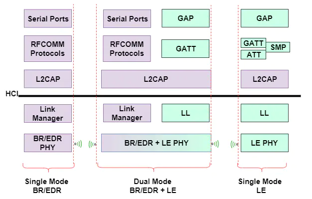
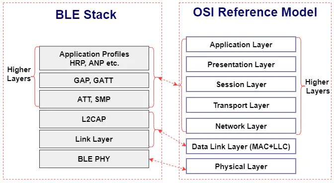
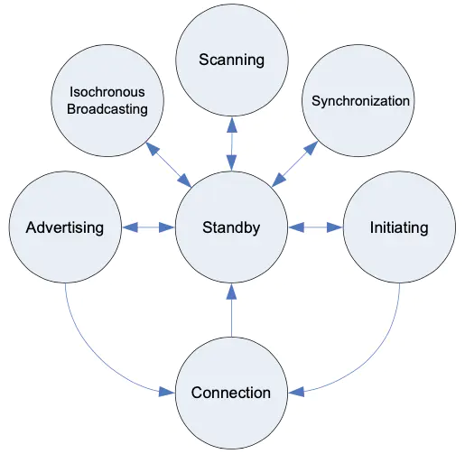

吐血推荐历史最全的蓝牙协议栈介绍
https://blog.csdn.net/xiaoxiaopengbo/article/details/107466841
--------------------------------------------------------------
蓝牙协议栈结构 https://www.jianshu.com/p/669540184e93

蓝牙核心系统结构
蓝牙协议分为四个层次：物理层（Physical Layer）、逻辑层（Logical Layer）、L2CAP Layer
和应用层（APP Layer）。

1、物理层
负责提供数据传输的物理通道（通常称为信道）。通常情况下，一个通信系统中存在几种不同类型的信道，如控制信道、
数据信道、语音信道等等。

2、逻辑层
在物理层的基础上，提供两个或多个设备之间、和物理无关的逻辑传输通道（也称作逻辑链路）。
在BR/EDR系统中，与对端的Link Manager通过LMP协议(Link Manager Protocol)进行通信；在BLE系统中则使用的是LL协
议(Link Layer Protocol)。

3、BLE链路层的状态机
包含Standby、Advertising、Scanning、Initiating、Connection、Synchronization、Isochronous Broadcasting state，
转换图如下所示

Master：从Initiating state进入Connection state
Slave：从Advertising state进入Connection state

4、HCI
HCI数据包分为command、event和data三种类型。command表示Host发送给Controller的命令，event为Controller发送给Host的
事件，data通常是实际的蓝牙传输数据。
command格式：opcode 16 bit | 参数长度 8 bit | 可变参数
event格式：event code 1 bit | 参数长度 1 bit | 可变参数

通常Host发送的command都会收到Controller的返回event，提示命令的执行结果。例如，HCI命令0x200c表示 LE Set Scan Enable，
并通过参数控制开启和关闭BLE的扫描，Controller执行完毕后返回event code 0x0e，即Command Complete，并附带status作为参数
表示结果是否成功。

5、ACL
HCI的ACL协议主要用于在Host和Controller之间，传输数据。
ACL数据包格式：Handle 12 bit | PB flag 2 bit | BC flag 2 bit | Data Total Length 16 bit | data
其中，Handle用于区分Host与Controller之间的逻辑链路，PB为Packet Boundary即包边界标志，BC(Broadcast)为
广播标志。由于数据总长度只用2个字节（16bit）表示，因此数据加上头部最多也只有65535bit，这意味着在发送
过大的数据时需要在ACL层进行分包和重组，PB Flag就是为了这个目的而设置的，根据PB Flag的值可以表示当前
数据包在完整数据中所处的位置。
【ACL层的分包和重组】

6、L2CAP层
L2CAP是逻辑链路控制和适配协议（Logical Link Control and Adaptation Protocol）的缩写，负责管理逻辑层提供的逻辑链路。  
基于该协议，不同Application可共享同一个逻辑链路。类似TCP/IP中端口（port）的概念。

ACL只提供了一个数据传输协议，类比于网络协议栈中的IP协议，在其之上使用的L2CAP协议可以类比于TCP/UDP协议，实现了更为完  
善的数据传输功能，包括：

协议/信道(L2CAP channel)多路复用、分段(segmentation)和重组(reassembly)、基于L2CAP channel的流量控制机制、错误控制重  
传机制、支持流式传输(streaming)、分片(fragmentation)和重组(recombination)、QoS(Quality of Service)…

L2CAP channel表示两个设备之间的一条逻辑链路，使用Channel ID(CID)进行区分，并以此为基本单元在Controller逻辑链路上进行  
多路复用。在基于连接的信道(connection-oriented channels)中，L2CAP PDU也称为B-Frame，其格式如下：

L2CAP PDU格式：length 16 bit | CID 16 bit | information payload

前32bit称为L2CAP header，length是除了header以外的payload长度。在不同的L2CAP模式中，information payload的内容也不尽相同，  
比如在Supervisor Frame(S-Frame)、Information Frame(I-Frame)。而对于无连接的L2CAP数据包，在payload之前还包含大于等于2字  
节的PSM(Protocol/Service Multiplexer)，头部还是和B-Frame一致的。

在L2CAP之上，有着各种各样的应用层协议，比如服务发现协议SDP，蓝牙传输协议RFCOMM/OBEX，BLE的属性协议ATT，甚至是通用以太网  
协议BNEP以及其上的TCP/IP网络栈等。通过分层和抽象使得上层应用无需关心底层的细节，从而实现了整个蓝牙协议栈的普适性和拓展性。

APP层
理解蓝牙协议中的应用层，基于L2CAP提供的channel，实现各种各样的应用功能。Profile是蓝牙协议的特有概念，为了实现不同平台下的  
不同设备的互联互通，蓝牙协议不止规定了核心规范（称作Bluetooth core），也为各种不同的应用场景，定义了各种Application规范，这  
些应用层规范称作蓝牙profile。
