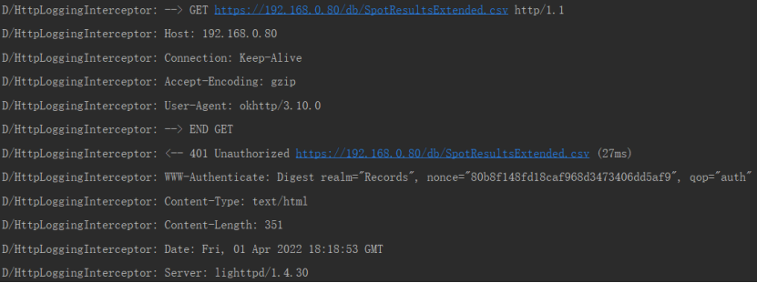
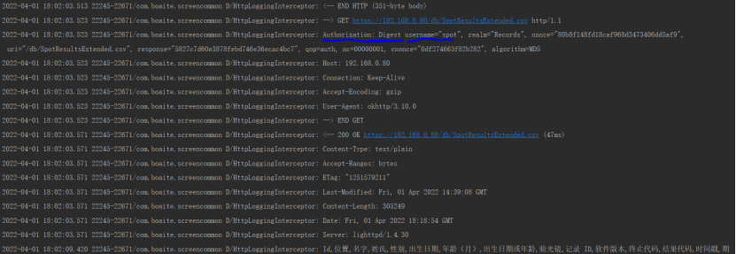

E/AndroidRuntime: FATAL EXCEPTION: OkHttp Dispatcher
    Process: com.boaite.screencommon, PID: 32765
    java.lang.NoSuchFieldError: No field INSTANCE of type Lokhttp3/internal/http/RequestLine; in class Lokhttp3/internal/http/RequestLine; or its superclasses (declaration of 'okhttp3.internal.http.RequestLine' appears in /data/app/com.boaite.screencommon-kPUH9SDFPqelp7c_ZAY_FQ==/base.apk!classes3.dex)
        at com.burgstaller.okhttp.digest.DigestAuthenticator.authenticateWithState(DigestAuthenticator.java:242)
        at com.burgstaller.okhttp.digest.DigestAuthenticator.authenticate(DigestAuthenticator.java:180)
        at com.burgstaller.okhttp.CachingAuthenticatorDecorator.authenticate(CachingAuthenticatorDecorator.java:35)
        at okhttp3.internal.http.RetryAndFollowUpInterceptor.followUpRequest(RetryAndFollowUpInterceptor.java:288)
        at okhttp3.internal.http.RetryAndFollowUpInterceptor.intercept(RetryAndFollowUpInterceptor.java:158)
        at okhttp3.internal.http.RealInterceptorChain.proceed(RealInterceptorChain.java:147)
        at okhttp3.internal.http.RealInterceptorChain.proceed(RealInterceptorChain.java:121)
        at com.burgstaller.okhttp.AuthenticationCacheInterceptor.intercept(AuthenticationCacheInterceptor.java:49)
        at okhttp3.internal.http.RealInterceptorChain.proceed(RealInterceptorChain.java:147)
        at okhttp3.internal.http.RealInterceptorChain.proceed(RealInterceptorChain.java:121)
        at okhttp3.RealCall.getResponseWithInterceptorChain(RealCall.java:200)
        at okhttp3.RealCall$AsyncCall.execute(RealCall.java:147)
        at okhttp3.internal.NamedRunnable.run(NamedRunnable.java:32)
        at java.util.concurrent.ThreadPoolExecutor.runWorker(ThreadPoolExecutor.java:1167)
        at java.util.concurrent.ThreadPoolExecutor$Worker.run(ThreadPoolExecutor.java:641)
        at java.lang.Thread.run(Thread.java:929)
E/DEBUG: encryptLog: false, zipCrashLog: false
    begin to generate java report

