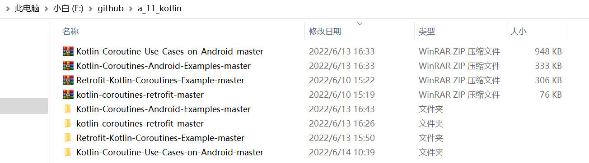

## 1.kotlin基础语法
基本数据类型条件控制
循环控制
类和对象、接口
继承
扩展
数据类和密封类
泛型
枚举类
对象表达式/声明
委托
--
Kotlin的基本语法和代码规范；
Kotlin的面向对象；
Kotlin的函数式编程；
扩展函数 ；
空指针类型安全 ；
类型系统；
泛型和型变 ；
注解和反射 ；
Kotlin 在 Android中的实际应用开发。
--
参考书籍
（1）Kotlin实战 -- FT有
Kotlin实战
9.1(151人评价)
【美】Dmitry Jemerov（德米特里·詹莫瑞福） / 【美】 Svetlana Isakova（斯维特拉娜·伊凡诺沃） / 覃宇 / 罗丽

（2）Kotlin核心编程
Kotlin核心编程
8.3(106人评价)
水滴技术团队 / 机械工业出版社 / 2019-4-15 / 89.00元

（3）第一行代码(第3版)  //kotlin版的第一行代码
第一行代码(第3版)作者: 郭霖
出版社: 人民邮电出版社
出品方: 图灵教育
丛书: 图灵原创
ISBN: 9787115524836

（1）kotlin跳转到kotlin，或者kotlin跳转到java
btn_interface.setOnClickListener {
    var intent = Intent()
    intent.setClass(this, MainActivity::class.java)
    startActivity(intent)
}

（2）java跳转到kotlin中，和java跳转到java中是一样的
Intent intent = new Intent(this, MainActivity.class);
startActivity(intent);

## 2.retrofit && Kotlin_Coroutines 项目
//E:\github\a_11_kotlin

## Retrofit-Kotlin_Coroutines-Example
(1)使用
data class {companion object}
enum class

(2)CoroutineLiveData的方法emit ☆☆
//viewmodel
 fun getUsers() = liveData(Dispatchers.IO) {
        emit(Resource.loading(data = null))
        try {
            emit(Resource.success(data = mainRepository.getUsers()))
        } catch (exception: Exception) {
            emit(Resource.error(data = null, message = exception.message ?: "Error Occurred!"))
        }
    }

## kotlin-coroutines-retrofit 不知道有啥用

## Coroutine Usecases on Android

## Kotlin-Coroutines-Android-Example

## 3.KKang
1、MVVM框架
@@   jetpack：ViewModel、DataBinding、Lifecycle、LiveData
    ---> jetpack/kotlin ：ViewModel、DataBinding、Lifecycle、LiveData

2、网络 retrofit okhttp RxJava   --->   retrofit okhttp  + 协程

3、Activity - 3Fragment
依赖注入框架 butterknife VS Dagger,不需要了    --->  Dagger2
数据库 greendao     --->   ROOM
LiveEventBus
@@  SharedPreferences  --->   DataStore 优于SharedPreferences、MMKV
@@  Gson解析json   ---> MoShi
@@  蓝牙com.clj.fastble.bluetooth   ---> ble蓝牙与固件升级

视频播放器 GSYVideoPlayer 项目地址： https://github.com/CarGuo/GSYVideoPlayer   --->
            ijkplayer 项目地址： https://github.com/Bilibili/ijkplayer
音乐播放器  android-UniversalMusicPlayer  项目地址：https://github.com/googlesamples/android-UniversalMusicPlayer
            Timber  项目地址：https://github.com/naman14/Timber   --->
MPAndroidChart开源图表库 com.github.mikephil.charting  --->
smartTable二维表格库https://github.com/huangyanbin/smartTable  --->

## 4.kotlin专题
let 表达式，和 ‘ ?. ’运算符一起使用
内联函数 inline
泛型
livedata switchmap
两种转化LiveData对象的方法:map()和switchMap()
object关键字主要有三种使用场景
    对象声明（object declaration）
    伴生对象（companion object）
    对象表达式（object expression）
java kotlin 编译、打包流程的区别
协程 suspend
采用Kotlin Flow和Live Data的高级用法
自定义框架、动画
Room数据库和协程
WorkManager
data class使用详解
网络retrofit okhttp  + 协程
协程 Coroutines flow
Java与Kotlin相互调用
lambda表达式
构造函数的使用
compose UI
依赖注入dagger2

java中使用GSON解析json，kotlin使用哪个库比较好？

扔物线 Jetpack Compose 腾讯课堂
扔物线 高杰 kotlin 上手指南 基础、进阶
https://rengwuxian.com/tag/kotlin/

jetpack
kotlin
Flutter
高级UI
性能优化
框架

