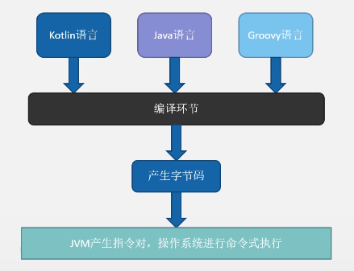
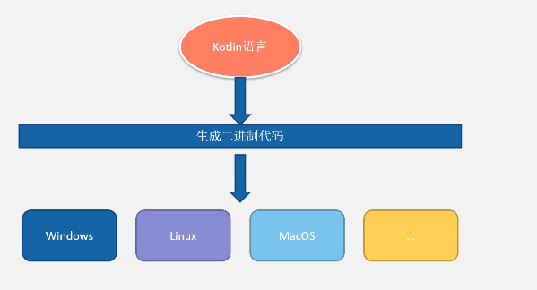
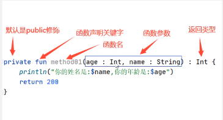

一个6个阶段 140*8min
Derry
https://www.bilibili.com/video/BV1kT4y1o7nP?p=1

一、变量、语句、函数

3、Kotlin是android的第一语言
原生、第一、决生

4、Kotlin语言和JVM虚拟机

富有表现力且简洁：少写样板代码
更安全的代码：借助自身类型系统所含的@Nullable 和@NonNull，Kotlin可帮助您避免NullPointerExceptions。降低崩溃。
可互操作：Kotlin可完全与Java编程语言互操作。
结构化并发：协程可简化异步编程，让您能够轻松高效地执行网络调用和数据库更新等任务。

5、学习kotlin语言的重要性
（1）集各个语言的精华于一身的新时代语言Kotlin
go\C++\Java等特点

扩展函数

（2）Kotlin走全栈语言之路
多平台移动端
服务器
web前端

6、跨平台特性
更加强大的跨平台

8、声明变量和内置数据类型

String  字符串
Char 单字符
Boolean true/false
Int 整型
Double 小数
List 集合
Set 无重复的元素集合
Map 键值对集合

Int --> java int
Float --> java float

9、只读变量
val

10、类型推断

11、编译时常量

12、查看kotlin编译后的字节码
Tools -- Kotlin -- Show Kotlin ByteCode
点击左上角的Decompile（反编译）可以查看kt 反编译后的java文件

13、引用类型学习
java语言两种数据类型：
	基本类型
	引用类型

Kotlin 语言只有一种数据类型：
	看起来都是引用类型，实际上编译器会在Java字节码中，修改成”基本类型“

14、range
	1..100

15、when
	类似switch

	when表达式的类型 是确定的，还是Any
	
	Unit  --  void

16、String模板

17、函数头学习

18、函数参数的默认参数

19、具名函数参数
对于多参数的函数，赋值的时候不容易搞错啊。

20、Unit函数特点
相当于void

21、Nothing类型
TODO

22、反引号中函数名特点

23、小结

24、匿名函数

25、函数类型 & 隐式返回

26、函数参数

27、关键字it

28、匿名函数的类型推断

29、lambda

30、在函数中定义参数是函数的函数

31、简略写法

32、函数内联学习

33、函数引用

34、函数类型作为返回类型

35、匿名函数与具名函数

36、可空性特点

37、安全调用操作符

38、let

39、非空断言操作符

40、使用if判断null值

41、空合并操作符

42、异常处理与自定义异常

43、substring

44、split

45、replace

46、== 与 ===

47、字符串遍历

49、数字类型的安全转换

50、Double转Int 与 类型格式化

51、apply 内置函数

52、let 内置函数

53、run

54、with

55、also

56、taketIf

57、takeUnless

