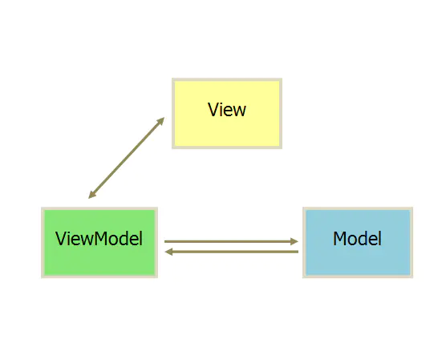

Mvvm模式: Databinding 与 ViewModel+LiveData+Repository
作者：Yagami3zZ
链接：https://www.jianshu.com/p/e7628d6e6f61
来源：简书

它采用双向绑定（data-binding）：View的变动，自动反映在 ViewModel，反之亦然。

MVVM模式：
View：对应于Activity/Fragment/自定义View，主要负责UI渲染。
Model：数据获取模块
ViewModel： 负责业务逻辑处理，负责View和Model的交互。和View层双向绑定。
Mvvm模式是通过将View层和ViewModel层进行双向绑定， View层的变化会自动通知给ViewModel层，而ViewModel层的数据变化也会通知给View层  
进行相应的UI的更新。这样，Model层只负责暴露获取数据的方法，View层只负责监听数据的变化更新，而ViewModel负责接收View层的事件指令  
以及获取并处理数据。从而实现业务逻辑和Ui的隔离。

使用MVVM模式的优点：
（1）低耦合度：
在MVVM模式中，数据处理逻辑是独立于UI层的。ViewModel只负责提供数据和处理数据，不会持有View层的引用。而View层只负责对数据变化的监听，  
不会处理任何跟数据相关的逻辑。在View层的UI发生变化时，也不需要像MVP模式那样，修改对应接口和方法实现，一般情况下ViewModel不需要做太多的改动。

（2）数据驱动：
MVVM模式的另外一个特点就是数据驱动。UI的展现是依赖于数据的，数据的变化会自然的引发UI的变化，而UI的改变也会使数据Model进行对应的更新。  
ViewModel只需要处理数据，而View层只需要监听并使用数据进行UI更新。

（3）异步线程更新Model：
Model数据可以在异步线程中发生变化，此时调用者不需要做额外的处理，数据绑定框架会将异步线程中数据的变化通知到UI线程中交给View去更新。
## 异步更新数据更新到UI的逻辑是什么呢？

（4）方便协作：
View层和逻辑层几乎没有耦合，在团队协作的过程中，可以一个人负责Ui 一个人负责数据处理。并行开发，保证开发进度。

（5）易于单元测试：
MVVM模式比较易于进行单元测试。ViewModel层只负责处理数据，在进行单元测试时，测试不需要构造一个fragment/Activity/TextView等等来进行数据层的测试。  
同理View层也一样，只需要输入指定格式的数据即可进行测试，而且两者相互独立，不会互相影响。

6、数据复用：
ViewModel层对数据的获取和处理逻辑，尤其是使用Repository模式时，获取数据的逻辑完全是可以复用的。开发者可以在不同的模块，多次方便的获取同一份来  
源的数据。同样的一份数据，在版本功能迭代时，逻辑层不需要改变，只需要改变View层即可。
